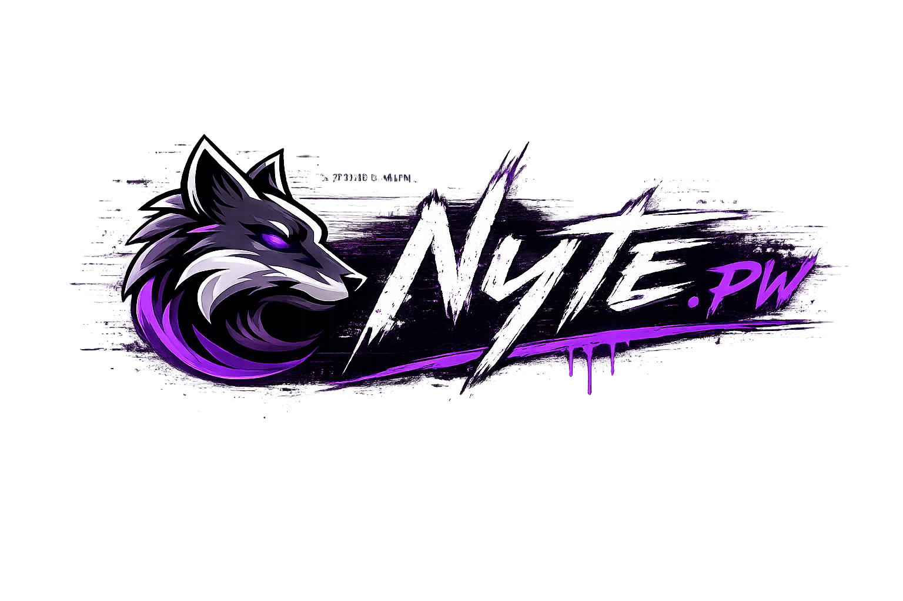
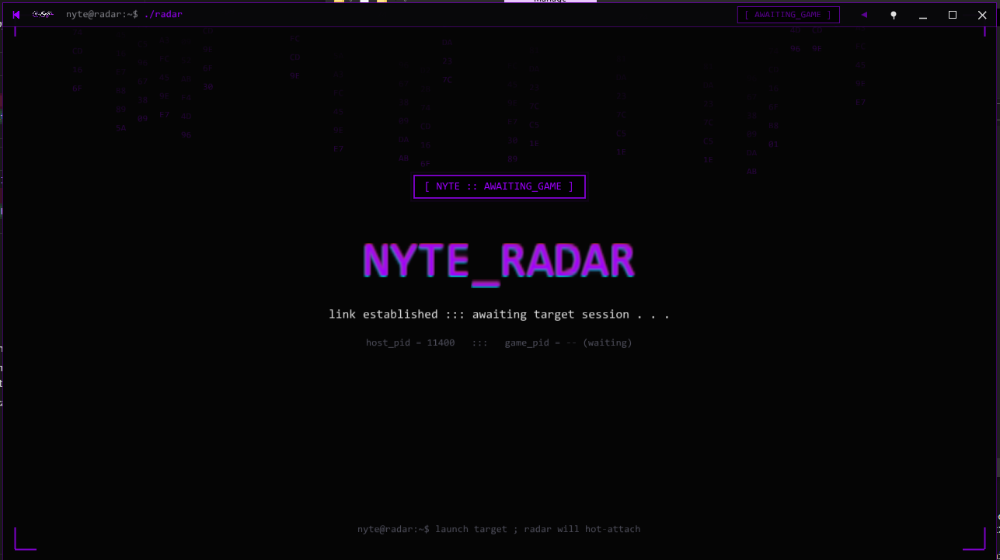
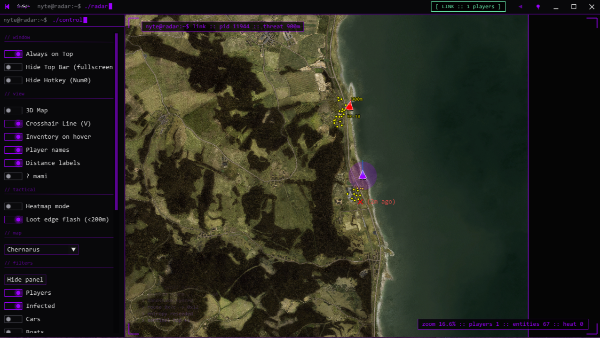

# Dayz-Radar---Kernel-Level-Hack

<!-- Portable repo: keep this file + logos/ at repo root. Rename to README.md for GitHub. Palette: neon #9D00FF, dark #050505. -->

  

  
  
  

  <code>KERNEL_INTEL</code> · <code>EXT_RADAR_ONLY</code> · <code>NO_SWAPCHAIN_HOOK</code>

  <strong>Intel on a second screen. Your game frame stays clean.</strong> 
  KERNEL-BACKED DAYZ RADAR — EXTERNAL WINDOW, NOT IN-GAME ESP.

  
  &nbsp;&nbsp;
  

<i>Loader · Radar viewer</i> — same art direction as <a href="https://nyte.pw">nyte.pw</a>

---

## Why a dedicated radar window beats painting on the game

Overlays live *inside* your frame: extra draw work, heavier CPU/GPU overlap with the client, and a footprint that’s easier to spot and correlate. **Nyte keeps the picture elsewhere** — a **separate desktop app** (second monitor or always-on-top), so you’re not feeding a mini-HUD into the swap chain.

| Overlay tax | External radar |
| ----------- | -------------- |
| **FPS & frametime** | Hooks and UI in the render path steal headroom when every ms counts. |
| **Resources** | In-process cheats fight DayZ for the same pool. The viewer runs **outside** the game process. |
| **Noise in clips & reports** | Stuff baked into the world view tends to read “obvious.” A standalone map window is a different class of footprint. |
| **Clutter** | No violet boxes over grass. You choose when the radar is visible — not the other way around. |

**Memory in. Radar out.** High-level reads run from **Ring 0 / kernel context** so you’re not stuck in the same user-mode lane as typical externals. *How* we wire that stack is **proprietary** — this page stays at product pitch, not implementation.

---

## Highlights

- **Legit-cheating lane** — Second screen or always-on-top; **game frame stays vanilla.**
- **Built for smooth sessions** — Skip the slideshow that in-engine overlays invite.
- **Operator-first UI** — Loot filters, searches, threat readouts — tuned in the **radar**, not sprayed over Chernarus.
- **Windows 10 / 11 x64** — Required.

---

## Pricing

Same numbers as the site: **no auto-renew** — grab a new key when you want another window of access.

| Plan | Duration | Price (site) | Access | Support |
| :--- | :--- | :--- | :--- | :--- |
| **Monthly** | 30 days | **50 USDT** | Full radar + lifetime key replacement policy | Priority support |

Fulfillment and payment (crypto / card) go through **[nyte.pw](https://nyte.pw)** and **verified Discord**.

---

## Getting started

1. Open **[nyte.pw](https://nyte.pw)** or join **[Discord](https://discord.gg/y3Q6HDmyze)**.
2. Purchase a seat / license key.
3. Download the **Nyte loader** (per your onboarding message).
4. Run the loader **as Administrator**.
5. Start **DayZ** when your flow says to.
6. Run the **radar app** on the display layout you like.

> **Requirement:** Windows 10 or 11, **64-bit**.

---

## Contact

- **Site:** [nyte.pw](https://nyte.pw)
- **Email:** nyte.pw@proton.me
- **Discord:** [discord.gg/y3Q6HDmyze](https://discord.gg/y3Q6HDmyze)
- **Discord user:** `nytepw`
- **Telegram:** `@Nytepw`

---

*README is onboarding + positioning only — no architecture, host processes, driver internals, or evasion playbook. That stays in-house.*

🔍 SEO Keywords
dayz kernel hack, kernel level dayz cheat, dayz kernel aimbot, kernel esp dayz, dayz driver hack tool, dayz external hack tool, dayz internal cheat, dayz undetected hack, dayz private cheat tool, dayz premium hack, dayz pro hack tool, dayz advanced cheat system, dayz legit hack tool, dayz auto aim tool, dayz aim assist hack, dayz triggerbot tool, dayz wallhack esp, dayz player esp tool, dayz loot esp hack, dayz item esp dayz, dayz radar hack tool, dayz advanced radar overlay, dayz map radar cheat, dayz visual enhancement cheat, dayz no recoil hack, dayz accuracy boost hack, dayz stealth aim tool, dayz silent aim assist, dayz external esp overlay, dayz bone tracking esp, dayz hitbox esp tool, dayz injector tool pc, dayz bypass cheat tool, dayz secure cheat loader, dayz streamproof esp, dayz overlay hack tool, dayz config hack tool, dayz script hack tool
